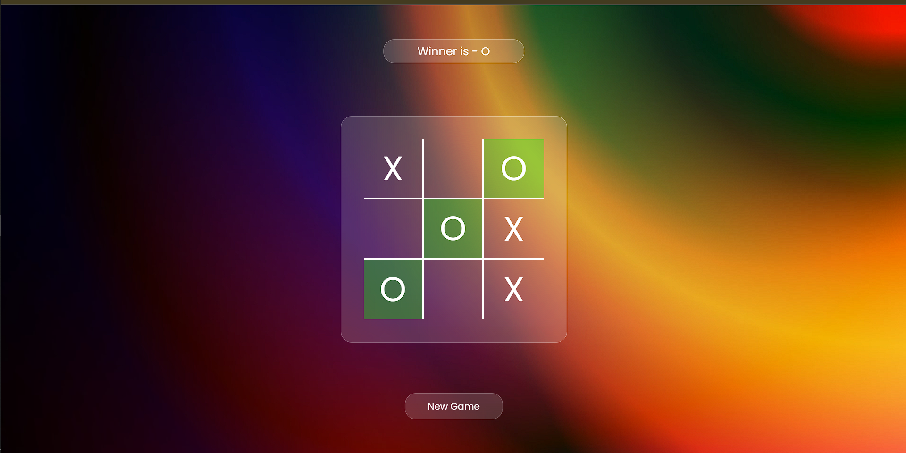

# 🎮 Tic Tac Toe

A simple and interactive **Tic Tac Toe** game built using **HTML5, CSS3, and JavaScript**.

Players take turns placing **X** and **O** on a 3×3 game board. The game automatically detects a winner or a tie and allows players to start a new game.

## 🌐 Live Demo

👉 **[Play Tic Tac Toe](https://rehanshaikh05.github.io/tic-tac-toe/)**

## 📸 Project Preview



## ✨ Features

* 🎮 Two-player gameplay
* ❌ X and ⭕ O player turns
* 🏆 Automatic winner detection
* 🤝 Automatic tie detection
* 🟢 Winning combination highlighting
* 🔄 New Game functionality
* 📱 Responsive game layout
* 🎨 Modern glassmorphism-style interface
* ⚡ Lightweight and fast

## 🛠️ Technologies Used

* **HTML5** — Structure of the game
* **CSS3** — Styling, layout and visual effects
* **JavaScript (ES6)** — Game logic and interactions
* **Google Fonts** — Poppins font

## 📂 Project Structure

```text
tic-tac-toe/
│
├── index.html
├── style.css
├── script.js
│
└── images/
    ├── favicon.ico
    └── gradient-bg.jpg
```

## 🧠 How the Game Works

The game starts with **Player X**.

Each player selects an empty box on the 3×3 board. JavaScript keeps track of the selected positions and checks them against the possible winning combinations.

There are **8 possible winning combinations**:

```text
[0, 1, 2]    [3, 4, 5]    [6, 7, 8]

[0, 3, 6]    [1, 4, 7]    [2, 5, 8]

[0, 4, 8]    [2, 4, 6]
```

When a player completes one of these combinations, the game displays the winner and highlights the winning boxes.

If all nine boxes are filled without a winner, the game declares a tie.

## 🚀 Run Locally

### 1. Clone the repository

```bash
git clone https://github.com/RehanShaikh05/tic-tac-toe.git
```

### 2. Open the project

```bash
cd tic-tac-toe
```

### 3. Run the project

Open `index.html` in your browser.

You can also use the **Live Server** extension in VS Code for a better development experience.

## 🎯 Learning Objectives

This project helped me practice:

* HTML page structure
* CSS Grid
* Responsive UI design
* DOM manipulation
* JavaScript event listeners
* JavaScript functions
* Arrays
* Conditional logic
* Game-state management
* Working with Git and GitHub
* Deploying a website using GitHub Pages

## 🔗 Links

**Live Demo:**
https://rehanshaikh05.github.io/tic-tac-toe/

**GitHub Repository:**
https://github.com/RehanShaikh05/tic-tac-toe

## 👨‍💻 Author

**Rehan Shaikh Riyaj**

GitHub:
https://github.com/RehanShaikh05

---

⭐ If you like this project, feel free to star the repository!
